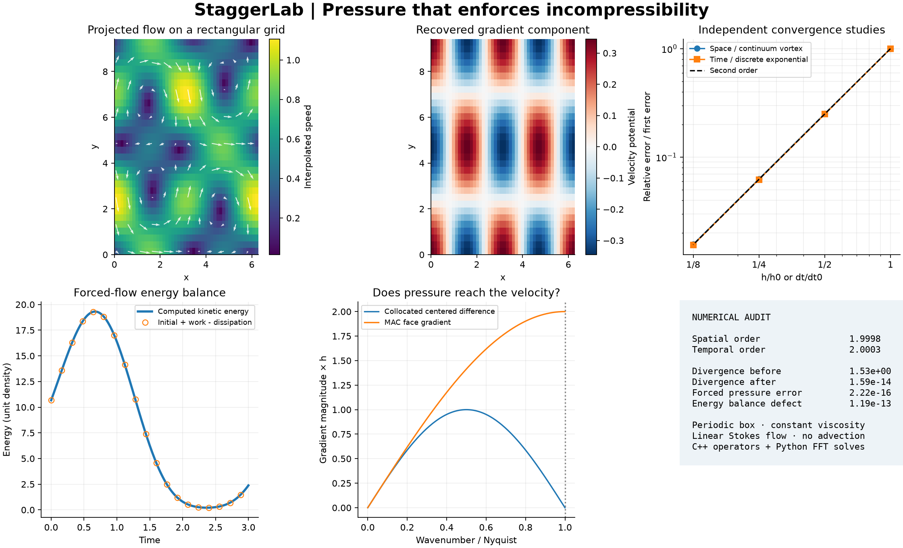

# StaggerLab

[](https://github.com/racostacme-come/staggerlab/actions/workflows/ci.yml)

**Pressure that enforces incompressibility.** An original C++17/Python laboratory
for staggered-grid pressure coupling, orthogonal Helmholtz projection, and energy
accounting in periodic, two-dimensional unsteady Stokes flow.

A pressure field can oscillate from cell to cell while a collocated centered
gradient sees zero. StaggerLab makes that failure visible, then implements a
compatible face/center discretization and checks the resulting conservation
identities. The result is a compact numerical library with independent analytical
benchmarks, a repeatable CLI study, a native C++ test, and cross-platform CI.



## Recorded results

The checked-in [machine-readable study](results/validation.json), generated on
Windows with Python 3.14.5 and NumPy 2.5.3, passes all ten acceptance checks.
Results are floating-point observations for these cases, not universal guarantees.

| Quantity | Observed value |
| --- | ---: |
| Spatial convergence order, final refinement | 1.99979 |
| Temporal convergence order, final refinement | 2.00027 |
| Maximum divergence before / after projection | 1.52646 / 1.59e-14 |
| Recovered velocity-potential error | 1.39e-16 |
| Maximum cumulative forced energy-balance defect | 1.19e-13 |
| Maximum forced midpoint-pressure error | 2.22e-16 |
| Python tests / native CTest cases | 41 / 1 |

The spatial study compares to a **continuum** decaying vortex. The temporal study
compares to a **semidiscrete** exponential on a fixed rectangular grid, separating
time error from spatial error. See [validation details](docs/validation.md) for
cases, thresholds, test coverage, and the scope of each claim.

## Build and run

Requires Python 3.11 or newer, a C++17 compiler, and CMake 3.20 or newer. On Windows,
install Visual Studio Build Tools with the Desktop development with C++ workload;
on Linux, a working GCC or Clang toolchain is sufficient. Build isolation installs
pybind11 and scikit-build-core. This is source installation, not a prebuilt binary
distribution. Runtime Python dependencies are NumPy and Matplotlib.

```bash
git clone https://github.com/racostacme-come/staggerlab.git
cd staggerlab
python -m venv .venv
# Linux/macOS:
source .venv/bin/activate
# Windows PowerShell instead:
# .venv\Scripts\Activate.ps1
python -m pip install -e ".[dev]"
python -m pytest
staggerlab --output out
python examples/forced_vortex.py
```

The CLI has one fixed, fully specified study. `--output` selects its artifact
directory; files with the study's names there are replaced. A successful run
prints JSON and exits 0; a failed numerical acceptance check exits 1. Invalid
arguments use argparse's normal error handling. No data downloads are needed.

```bash
# Standalone native kernel checks (no Python headers or bindings required):
cmake -S . -B build/native -DSTAGGERLAB_PYTHON=OFF
cmake --build build/native --config Release
ctest --test-dir build/native -C Release --output-on-failure

# Source archive and wheel, including a fresh build from the source archive:
python -m build
ruff check .
ruff format --check .
clang-format --dry-run --Werror cpp/operators.hpp cpp/bindings.cpp cpp/test_operators.cpp
```

`requirements-repro.txt` records the local Python 3.14 Windows environment,
excluding the editable project itself and isolated build tools. It is a snapshot,
not a portable lockfile. For that environment, install it before `pip install -e .`.
The dependency ranges in `pyproject.toml` are used by the Python 3.11/3.14,
Ubuntu/Windows CI matrix. Other platforms and versions are not claimed as tested.

## Equations and placement

With unit density, constant kinematic viscosity, and periodic boundaries on
`[0,Lx) × [0,Ly)`, the governing equations are

$$
\partial_t\mathbf u=-\nabla p+\nu\Delta\mathbf u+\mathbf f,
\qquad \nabla\cdot\mathbf u=0,\qquad \langle p\rangle=0.
$$

This is the **linear Stokes system**; there is no nonlinear convective term.
Pressure is kinematic pressure. Dimensional inputs must use a consistent unit
system; the examples use nondimensional coordinates and parameters.

All arrays have shape `(ny,nx)`, with row `j` and column `i`. Store one periodic
copy of each unknown, without ghost cells or duplicated endpoints:

| Field | Coordinates |
| --- | --- |
| Pressure `p[j,i]` | `((i+1/2) dx, (j+1/2) dy)` |
| x velocity `u[j,i]` | `(i dx, (j+1/2) dy)` |
| y velocity `v[j,i]` | `((i+1/2) dx, j dy)` |
| Streamfunction `psi[j,i]` | `(i dx, j dy)` |

Periodic indexing gives

$$
(D\mathbf u)_{j,i}=\frac{u_{j,i+1}-u_{j,i}}{\Delta x}
+\frac{v_{j+1,i}-v_{j,i}}{\Delta y},
\quad
(G_xp)_{j,i}=\frac{p_{j,i}-p_{j,i-1}}{\Delta x},
\quad
(G_yp)_{j,i}=\frac{p_{j,i}-p_{j-1,i}}{\Delta y}.
$$

Under the uniform volume-weighted inner product, `G = -D*` and `L = DG` is the
five-point periodic Laplacian. The C++ kernels implement these stencils directly.
The Python layer supplies FFT solves, validation, integration, and analysis.
Bindings validate shapes and copy buffers; this implementation prioritizes
clarity and checked interfaces over zero-copy throughput.

## Projection and pressure

For any face field `w`, solve `L phi = D w`, choosing zero mean for `phi`, then
set `P w = w - G phi`. The eigenvalue for FFT mode `(k,l)` is

$$
\lambda_{k,l}=-\frac{4}{\Delta x^2}\sin^2\!\frac{\pi k}{n_x}
-\frac{4}{\Delta y^2}\sin^2\!\frac{\pi l}{n_y}.
$$

Only the constant mode is null. Its coefficient is set to zero. Poisson sources
with mean larger than `1e-12 * max(1, max(abs(rhs)))` are rejected; smaller means
are treated as roundoff and removed. The velocity means remain unchanged.
The identities `DP=0`, `P²=P`, and

$$
\tfrac12\|\mathbf w\|_h^2
=\tfrac12\|P\mathbf w\|_h^2+\tfrac12\|G\phi\|_h^2
$$

hold in exact arithmetic. The returned projection potential is **not a physical
pressure**. For the Stokes step, projecting the supplied midpoint force yields
the physical zero-mean midpoint pressure from `L p = D f`.

On an even grid, the alternating pressure mode has centered collocated gradient
symbol `sin(theta)/h`, zero at Nyquist. The MAC gradient magnitude is
`2 sin(theta/2)/h`, nonzero there. The comparison is a stencil diagnosis, not a
claim that every collocated CFD method is defective; stabilization and other
coupling constructions can address this issue.

## Time step and energy ledger

For divergence-free initial velocity, constant viscosity and periodic geometry
allow projection and the Laplacian to commute. StaggerLab uses the unsplit
projected Crank-Nicolson system

$$
\left(I-\frac{\nu\Delta t}{2}L\right)\mathbf u^{n+1}
=\left(I+\frac{\nu\Delta t}{2}L\right)\mathbf u^n
+\Delta t\,P\mathbf f^{n+1/2}.
$$

The forcing must be evaluated by the caller at the step midpoint. A diagonal FFT
Helmholtz solve advances each component. This is a finite-difference spatial
method using an FFT linear solver, **not spectral differentiation**. No artificial
pressure boundary condition or pressure-correction splitting is needed on this
periodic constant-coefficient domain.

With `um=(u_old+u_new)/2`, the returned ledger contains

$$
E=\tfrac12\|\mathbf u\|_h^2,\quad
Q=-\nu\langle\mathbf u_m,L\mathbf u_m\rangle_h,\quad
W=\langle\mathbf u_m,\mathbf f_m\rangle_h,
\qquad E^{n+1}-E^n+\Delta t(Q-W)=0.
$$

`Q` and `W` are powers, and `energy_balance_defect` is the step's residual in the
last identity. The pressure does no work against a discretely solenoidal velocity.
Without forcing, energy is nonincreasing. Crank-Nicolson is A-stable here but
not L-stable: large steps can produce alternating, weakly damped high-frequency
modes, so energy stability does not guarantee temporal accuracy or monotonicity.

## Python API

```python
import numpy as np
from staggerlab import Grid, project, stokes_step

g = Grid(nx=48, ny=32, lx=2 * np.pi, ly=3 * np.pi)
x, y = g.coordinates("vertex")
u, v = g.curl(np.sin(x) * np.sin(2 * y / 3))
s = stokes_step(g, u, v, dt=0.02, viscosity=0.1)
print(s.energy, s.energy_balance_defect)
print(np.max(np.abs(g.divergence(s.u, s.v))))

# Use this explicitly for a nonsolenoidal initial condition:
p = project(g, u + 0.01 * np.cos(x), v)
```

`Grid` also exposes `field`, `coordinates`, `divergence`, `gradient`, `laplacian`,
`poisson`, `inner`, and `energy`. `coordinates` accepts `p`, `u`, `v`, or `vertex`.
`curl` computes face velocities from a periodic vertex streamfunction and is
discretely divergence-free, including on rectangular grids. Simply sampling an
arbitrary continuum solenoidal field at faces need not preserve discrete
divergence; project it or build it with `curl`.

`project` returns `u`, `v`, `potential`, `energy_removed`, and
`orthogonality_defect`. `stokes_step` returns `u`, `v`, `pressure_midpoint`,
`energy`, `dissipation_power`, `forcing_power`, and `energy_balance_defect`.
Methods do not modify input fields. Returned NumPy arrays remain mutable.
Input fields must be real, finite, and correctly shaped; cell counts must be
integers at least 3; lengths and time steps positive; viscosity nonnegative.
`stokes_step` rejects initial divergence above
`1e-10 * max(1, max(abs(u))/dx + max(abs(v))/dy)`. This is a floating-point
acceptance tolerance, not an incompressibility error estimate.

## Outputs and boundaries of the project

The CLI writes `spatial.csv`, `temporal.csv`, `fields.csv`, `energy.csv`,
`pressure_spectrum.csv`, `validation.json`, and `staggerlab_audit.png`.
The checked-in `results/` directory contains a complete reproducible sample.
`fields.csv` stores velocity interpolated to cell centers for plotting; solver
velocities and kinetic-energy quadrature remain on faces. Artifact names and
JSON schema version 1 are documented here; numerical low bits may vary by platform.

This project covers uniform rectangular periodic grids, constant viscosity,
and linear incompressible flow only. It has no walls, inflow/outflow, immersed
boundaries, variable coefficients, turbulence, nonlinear advection, adaptivity,
restart format, or automatic timestep controller. No experimental fluid data
are used. Roundoff-level residuals in manufactured cases do not establish
physical accuracy for other applications. Extreme scales and conditioning are
not validated; basic finiteness checks are not interval arithmetic. FFTs use
O(N log N) work and O(N) storage; there is no measured speedup or scalability claim.

## Provenance and references

The topic was selected from local CFD lecture/lab filenames identifying numerical
approximation, time integration, scheme analysis, and the unsteady incompressible
flow lab. Only filenames were inspected for grounding. All implementations,
derivations, tests, synthetic fields, plots, and documentation here were authored
for this project. No course handouts, exercise code, solutions, exams, or private
datasets are included. Software-lab practices informed packaging, tests, and CI.

Public conceptual references (not code sources):

- F. H. Harlow and J. E. Welch (1965), *Numerical Calculation of Time-Dependent
  Viscous Incompressible Flow of Fluid with Free Surface*, Physics of Fluids 8,
  2182–2189. [Paper](https://www.cs.rpi.edu/~cutler/classes/advancedgraphics/S10/papers/harlow_welch.pdf),
  [DOI](https://doi.org/10.1063/1.1761178). Historical staggered-grid context;
  StaggerLab does not implement its free-surface method.
- A. J. Chorin (1968), *Numerical Solution of the Navier-Stokes Equations*,
  Mathematics of Computation 22, 745–762.
  [DOI](https://doi.org/10.1090/S0025-5718-1968-0242392-2),
  [author's publication list](https://math.berkeley.edu/~chorin/).
  Historical projection-method context; the present constant-coefficient
  periodic Stokes integration is a narrower construction.

MIT licensed. See [contribution and verification guidance](CONTRIBUTING.md).
